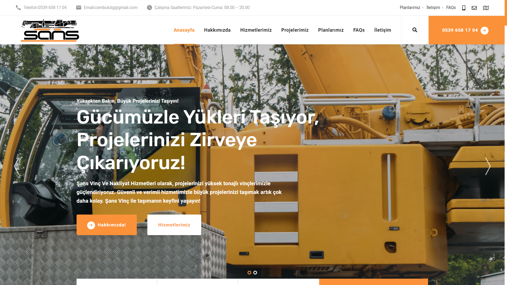
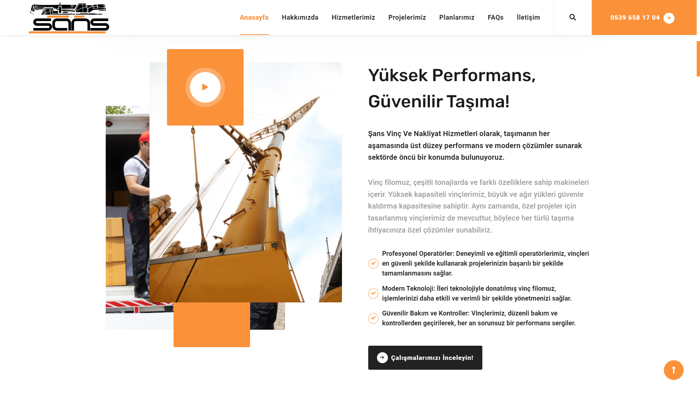
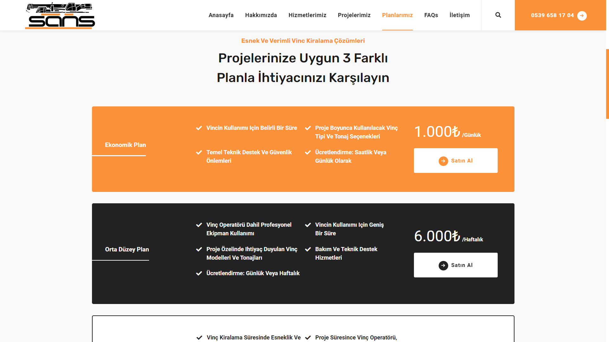

<h1 style="color:#e67e22;">🏗️ Şans Vinç ve Nakliyat Hizmetleri Web Sitesi</h1>

<strong style="color:#e74c3c;">Proje:</strong> Şans Vinç ve Nakliyat Hizmetleri Web Sitesi

<strong style="color:#e74c3c;">Müşteri:</strong> Şans Vinç ve Nakliyat Hizmetleri

Şans Vinç ve Nakliyat Hizmetleri, geniş hizmet ağımız, uzman ekibimiz, teknolojik altyapımız ve vinç kiralama hizmetlerimizle iş dünyasına değer katıyoruz. Türkiye'nin dört bir yanına yayılan şubelerimizle, müşterilerimize coğrafi mesafe tanımadan ulaşıyor ve projelerinizi en güvenilir şekilde yönetiyoruz. Deneyimli kadromuz, modern teknolojik çözümlerimiz ve sürdürülebilir iş anlayışımızla işinizi güçlendirmeniz için yanınızdayız. Şans Vinç ve Nakliyat Hizmetleri ile çalışın, projelerinizi güvenle teslim edin!

<strong style="color:#e74c3c;">Hedef:</strong> Hizmetlerini dijital platformda tanıtarak potansiyel müşterilere ulaşmak ve online talepleri karşılamak

<h2 style="color:#2ecc71;">Proje Özeti</h2>

Bu proje, Şans Vinç ve Nakliyat Hizmetleri için güçlü ve kullanıcı dostu bir web sitesi geliştirmeyi hedeflemektedir. Web sitesi, firmanın hizmetlerini tanıtmak, müşteri taleplerini online olarak toplamak ve sektördeki prestijini artırmak amacıyla tasarlanmıştır.

<h2 style="color:#2ecc71;">Öne Çıkan Özellikler</h2>
<ul>
    <li><strong style="color:#f39c12;">Gelişmiş Hizmet Tanıtımı:</strong> Firmanın sunduğu tüm vinç kiralama ve nakliyat hizmetlerinin detaylı açıklamaları.</li>
    <li><strong style="color:#f39c12;">Müşteri Referansları:</strong> Firmanın sektördeki güvenilirliğini artırmak için öne çıkarılan müşteri yorumları.</li>
    <li><strong style="color:#f39c12;">Duyarlı Tasarım:</strong> Tüm cihazlarla uyumlu, mobil ve masaüstü kullanımına uygun bir web sitesi.</li>
</ul>

<h2 style="color:#2ecc71;">Görseller</h2>

Web sitesinin bazı bölümlerine ait görseller aşağıda sunulmuştur:

<!-- Görsel 1 -->

<!-- Görsel 2 -->

<h2 style="color:#2ecc71;">Websitesi Linki</h2>

Projeyi canlı olarak görmek için <a href="https://sansvincvenakliyat.com/" target="_blank" style="color:#2980b9; text-decoration: none;">buraya tıklayın</a>.

<h2 style="color:#2ecc71;">Notlar</h2>

Bu proje, müşteri talebi doğrultusunda özel olarak geliştirildiği için kaynak kodları bu depoda paylaşılmamaktadır. Ancak proje hakkında daha fazla bilgi almak veya benzer bir çalışma talep etmek isterseniz, benimle iletişime geçebilirsiniz.

<h2 style="color:#2ecc71;">İletişim</h2>

Bu projeyle ilgili detaylar veya yeni projeler hakkında bilgi almak için <a href="mailto:treebsoftware@gmail.com" style="color:#c0392b; text-decoration: none;">buradan</a> bana ulaşabilirsiniz.

<em>Bu proje, Şans Vinç ve Nakliyat Hizmetleri'nin dijital dünyada daha güçlü bir varlık oluşturması için tasarlanmıştır.</em>

